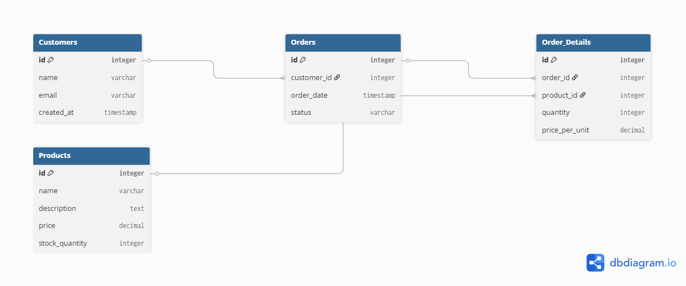
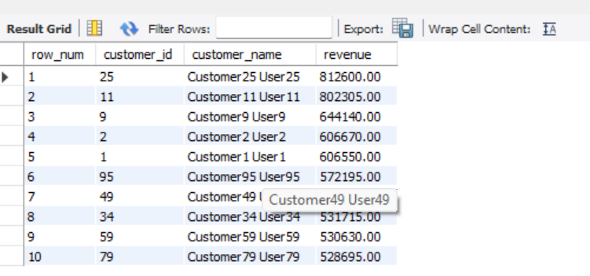
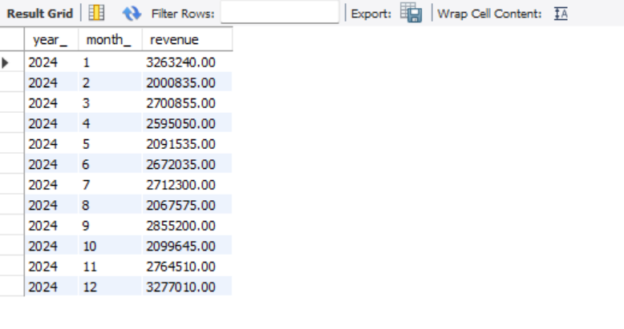
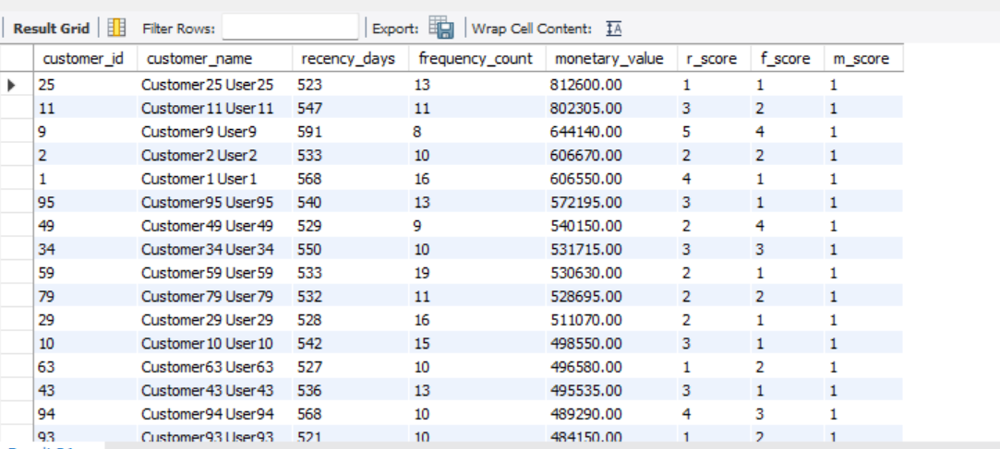

# SQL Ecommerce Analytics Project

## Project Overview

This project simulates an ecommerce business database and performs sales analytics using MySQL.

The goal is to answer business questions such as:

- Who are the top customers?
- Which products generate the most revenue?
- Which cities drive sales?
- How does revenue change over time?

---

## Database Schema

Tables:

- customers
- products
- orders
- order_details

## Database Diagram

---

## Skills Demonstrated

- Joins
- Aggregate Functions
- CTEs
- Window Functions
- Views
- Stored Procedures
- Indexing
- Query Optimization

---

## Analysis Performed

### Top Customers

Revenue generated by each customer.

### Product Performance

Top selling products by quantity and revenue.

### Revenue by Category

Comparison of product categories.

### RFM Analysis

Customer segmentation using:

- Recency
- Frequency
- Monetary

---

## Screenshots

### Top Customers

### Monthly Revenue

### RFM Analysis

